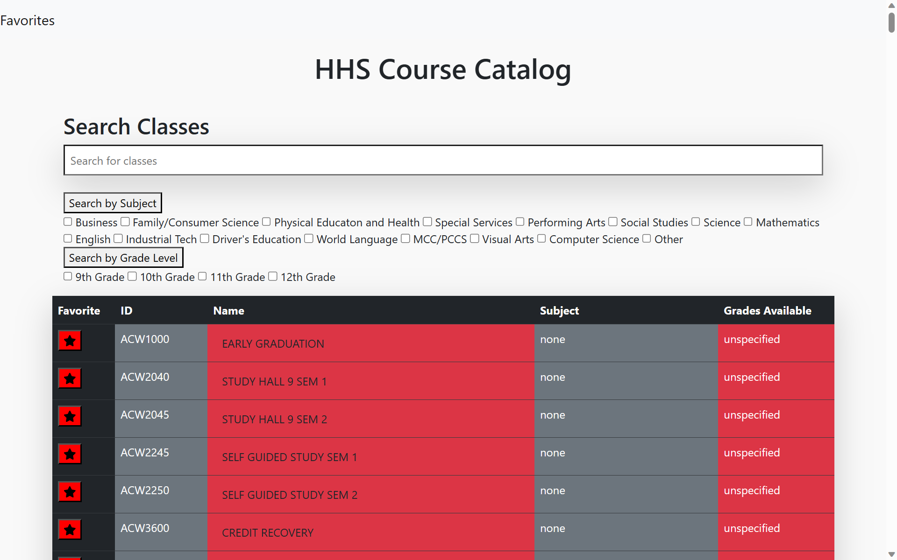
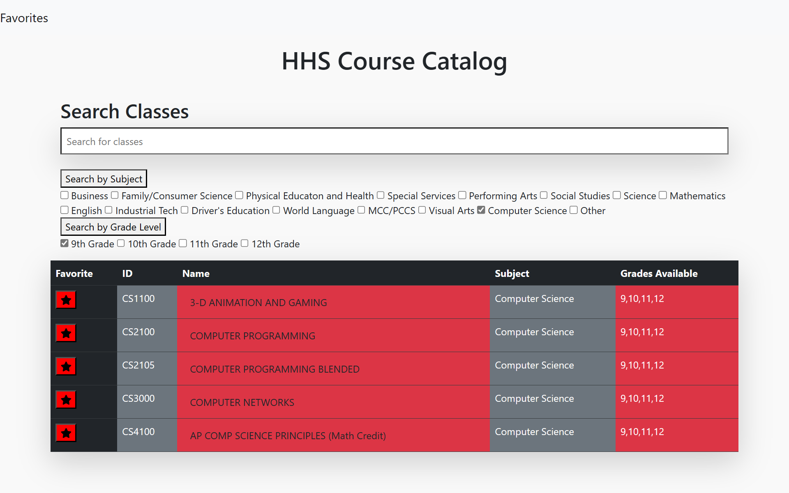
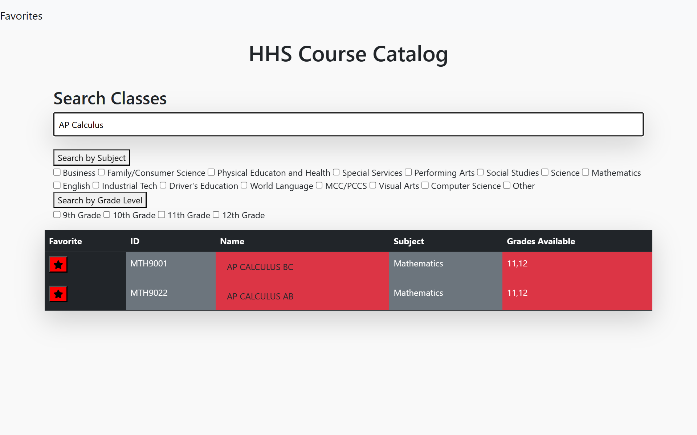
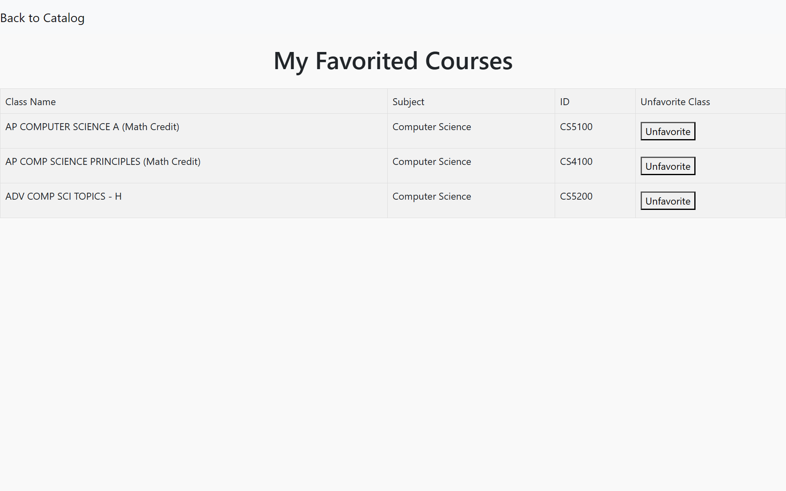
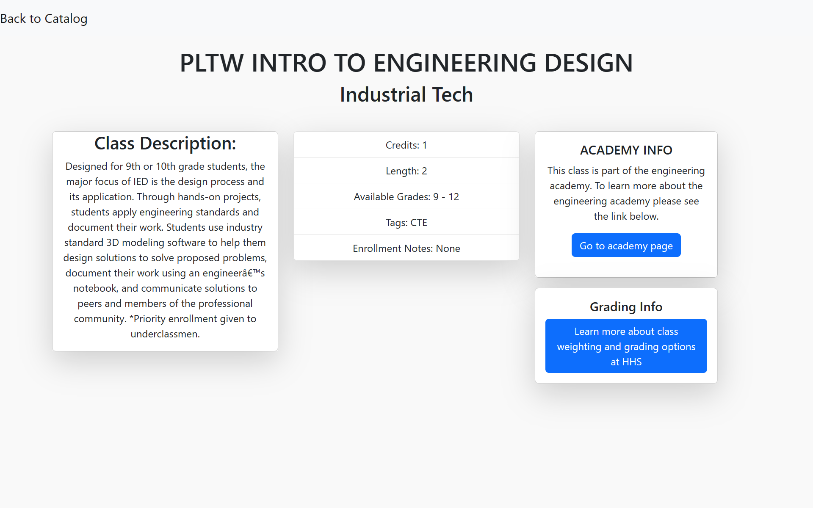

# HHS-Course-Catalog

This is a project that a partner and I created in our Advanced Computer Science Topics class at Huntley High School. We were instructed to identify a problem in our school and try to code a solution to it. We thought that our school's course catalog wasn't very user friendly since it's just a long pdf. We wanted to code a more interactive course catalog with filters to make it easier for students to find classes. Although we didn't get to the point to where our code would actually be used by the school, this project still gave us valuable experience in SQL, Python, HTML, Flask, and CSS.

### Pictures

